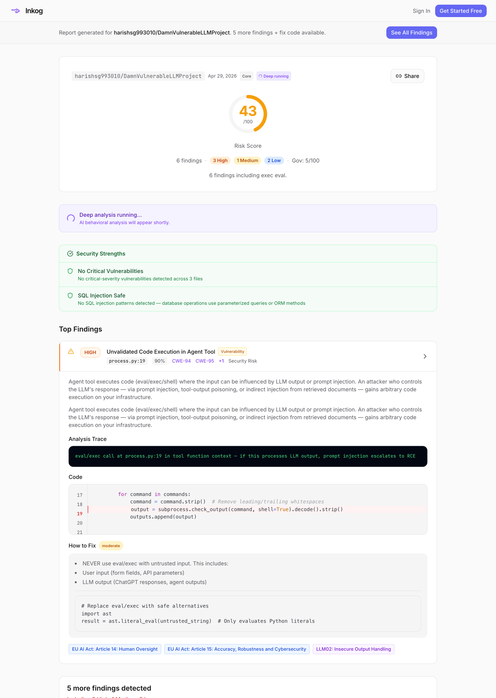

<p align="center">
  
</p>

<h3 align="center">The pre-flight check for AI agents.</h3>

<p align="center">
  Static analysis that catches the bugs only agent code can have — token bombing, prompt injection, missing oversight, compliance gaps — before they ship.
</p>

<p align="center">
  <a href="https://github.com/inkog-io/inkog/releases"></a>
  <a href="LICENSE"></a>
  <a href="https://goreportcard.com/report/github.com/inkog-io/inkog"></a>
  <a href="https://github.com/inkog-io/inkog/actions/workflows/ci.yml"></a>
  <a href="https://discord.gg/NuG4SSGRH"></a>
</p>

<p align="center">
  
</p>

<p align="center">
  <a href="https://app.inkog.io/report/83556081-478e-4c64-af52-126b8c83eb6d">
    
  </a>
  <br>
  <sub><i>Every scan is a shareable report — <a href="https://app.inkog.io/report/83556081-478e-4c64-af52-126b8c83eb6d">view this one live</a></i></sub>
</p>

---

## Why Inkog

Most security tools find SQL injection. Inkog finds the things that **only break in agent code**:

- **Token bombing** — loops where the LLM controls termination, draining your API budget
- **Recursive tool calling** — one user request fans out into 10,000 LLM invocations
- **Prompt injection sinks** — RAG output flowing into a `system` prompt no one reviewed
- **Missing oversight** — destructive tools (refunds, deletes, money) firing without human approval
- **Cross-tenant leakage** — global state shared between agent invocations
- **MCP tool poisoning** — malicious tool descriptions hijacking your agent

Findings map directly to **EU AI Act Article 14 / 15**, **NIST AI RMF**, **ISO 42001**, and **OWASP LLM Top 10** — at the article level, not just bucket labels.

[**Try it on a public repo →**](https://inkog.io/scan)  ·  no signup, results in 60 seconds.

## Quick start

```bash
# No install
npx -y @inkog-io/cli scan .

# Or install permanently
brew tap inkog-io/inkog && brew install inkog
go install github.com/inkog-io/inkog/cmd/inkog@latest
```

```bash
# Get a free API key at app.inkog.io
export INKOG_API_KEY=sk_live_...
inkog .
```

## GitHub Actions

```yaml
- uses: inkog-io/inkog@v1
  with:
    api-key: ${{ secrets.INKOG_API_KEY }}
    sarif-upload: true   # findings show in the GitHub Security tab
```

[Workflow example](examples/ci/github-actions.yml) · [GitLab / Azure / Jenkins templates](docs/CI_CD_INTEGRATION.md)

## How Inkog compares

The closest direct alternative to Inkog is **[SplxAI Agentic Radar](https://github.com/splx-ai/agentic-radar)** — also OSS, also static analysis of agent code. Honest side-by-side:

|  | **Inkog** | SplxAI Agentic Radar |
|---|---|---|
| Approach | Static code analysis | Static code analysis |
| Frameworks supported | 21 (Python · TS · no-code) | 4 (CrewAI · LangGraph · OpenAI Agents · n8n) |
| Compliance mapping | Article-level (EU AI Act, NIST, ISO 42001, OWASP) | Generic risk taxonomy |
| MCP server auditing | ✓ | – |
| AGENTS.md governance verification | ✓ | – |
| Topology visualization | – | ✓ (interactive graph) |
| GitHub stars | 28 | 956 |
| License | Apache 2.0 CLI · proprietary engine | Fully OSS |

**Different problem, complementary tools** — use Inkog *with* one of these, not instead of:

- **Dev-environment scanning** — [Snyk Agent Scan](https://github.com/snyk/agent-scan), [AgentShield](https://github.com/affaan-m/agentshield) audit installed MCP servers and editor configs on your laptop (different scan target — your laptop, not your repo)
- **Runtime adversarial probing** — [Lakera](https://www.lakera.ai/ai-red-teaming), [Straiker](https://www.straiker.ai/), [Crucible](https://crucible-security.github.io/crucible-website/), [MS Red Teaming Agent](https://learn.microsoft.com/en-us/azure/foundry/concepts/ai-red-teaming-agent), [NVIDIA Garak](https://github.com/NVIDIA/garak) test deployed agents at the API boundary
- **Quality / hallucination evaluation** — [Giskard](https://github.com/Giskard-AI/giskard-oss), [Patronus AI](https://www.patronus.ai/) test answer correctness and safety, not code-level security

[Detailed comparison →](docs/comparisons.md)

## Frameworks

**Code-first:** LangChain · LangGraph · CrewAI · AutoGen · AG2 · OpenAI Agents · Semantic Kernel · Azure AI Foundry · LlamaIndex · Haystack · DSPy · Phidata · Smolagents · PydanticAI · Google ADK

**No-code:** n8n · Flowise · Langflow · Dify · Microsoft Copilot Studio · Salesforce Agentforce

## Use from your editor

```bash
npx -y @inkog-io/mcp
```

Adds Inkog as an MCP server in Claude Code, Cursor, ChatGPT — 7 tools including MCP server auditing, Skill package scanning, multi-agent topology analysis. [MCP integration →](https://docs.inkog.io/integrations/mcp)

## More features

<details><summary><strong>Deep scan</strong> — orchestrator-driven analysis with enriched findings, agent profile, HTML report</summary>

```bash
inkog -deep .
inkog -deep -output html . > report.html
```

[Deep scan docs →](https://docs.inkog.io/cli/deep-scan)
</details>

<details><summary><strong>Skill & MCP scan</strong> — audit SKILL.md packages and MCP servers</summary>

```bash
inkog skill-scan .
inkog mcp-scan github
inkog skill-scan --deep --repo https://github.com/org/repo
```

[Skill & MCP scan docs →](https://docs.inkog.io/cli/skill-scan)
</details>

<details><summary><strong>Inkog Red</strong> — adversarial testing of running agents</summary>

```bash
inkog red --target https://your-agent.example.com
```

Probes prompt injection, jailbreaks, and tool misuse against live endpoints. [Inkog Red docs →](https://docs.inkog.io/red)
</details>

<details><summary><strong>Scan policies</strong> — five presets from low-noise to full-audit</summary>

```bash
inkog . --policy low-noise        # only proven vulnerabilities
inkog . --policy balanced         # default — vulnerabilities + risk patterns
inkog . --policy comprehensive    # everything including hardening tips
inkog . --policy governance       # Article 14 controls, authorization, audit trails
inkog . --policy eu-ai-act        # EU AI Act compliance report
```

[Policy reference →](https://docs.inkog.io/cli/policies)
</details>

## Community

- 💬 [Discord](https://discord.gg/NuG4SSGRH) — questions, feedback, feature requests
- 📚 [Documentation](https://docs.inkog.io)
- 🐛 [Issues](https://github.com/inkog-io/inkog/issues)
- 🤝 [Contributing](CONTRIBUTING.md) · [Changelog](CHANGELOG.md)

<details><summary>Translations</summary>

<a href="docs/i18n/README.zh-CN.md">简体中文</a> ·
<a href="docs/i18n/README.ja.md">日本語</a> ·
<a href="docs/i18n/README.ko.md">한국어</a> ·
<a href="docs/i18n/README.es.md">Español</a> ·
<a href="docs/i18n/README.pt-BR.md">Português</a> ·
<a href="docs/i18n/README.de.md">Deutsch</a> ·
<a href="docs/i18n/README.fr.md">Français</a>

</details>

## License

Apache 2.0 — see [LICENSE](LICENSE).
