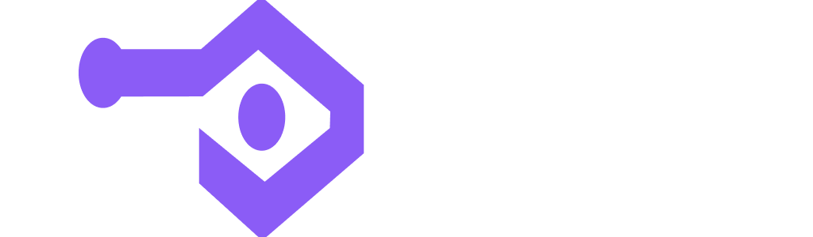

<div align="center">
  
</div>

[](LICENSE)
[]()
[](https://ghcr.io/inkog-io/inkog)
[](https://join.slack.com/t/inkog-io/shared_invite/zt-3jrzztm28-cXyokCXO8KjKC6nBI0l4Gw)

# Inkog Verify: Secure Agentic Logic.

## The Static Analysis Engine for AI Agents. Part of the Inkog Platform.

---


*Inkog scanning a LangGraph agent and detecting a token bombing vulnerability.*

[](https://cal.com/inkog/demo)

---

## Quick Start

### Docker (Recommended)

```bash
docker run -v $(pwd):/app ghcr.io/inkog-io/inkog:latest /app
```

### Go Install

```bash
go install github.com/inkog-io/inkog/cmd/cli@latest
inkog .
```

### GitHub Action

```yaml
- name: Run Inkog Security Scan
  uses: inkog-io/inkog@latest
  with:
    path: .
```

---

## Why Inkog?

### Universal Framework Support
One scanner for 15+ agent frameworks. Analyzes Python code (LangChain, CrewAI) and JSON workflows (n8n, Flowise) with the same detection rules. No framework-specific setup required.

### Cross-File Analysis
Tracks user input as it flows through your codebase—across functions, files, and tool calls. Detects prompt injection vectors that span your entire agent architecture.

### Static Logic Analysis
Inkog Verify parses your Code (Python) and Configs (n8n) to find structural flaws *before* you deploy:
- **Infinite Loops** — Agents stuck in cycles with no exit condition
- **Token Bombing** — Unbounded context growth that drains your API budget
- **Recursive Tool Calls** — Tools calling themselves without depth limits
- **Missing Rate Limits** — Unthrottled API calls that can spiral out of control

### Hybrid Privacy
Source code is redacted **locally** before transmission. Only the sanitized logic graph is analyzed remotely. Secrets, API keys, and credentials never leave your machine.

### Extensible Rules
Pluggable YAML-based rule engine. Add custom detection patterns for your organization's specific security policies.

---

## The Inkog Platform

| Product | Status | Type | Capabilities |
|---------|--------|------|--------------|
| **Inkog Verify** | ✅ Live | Static Analysis (SAST) | AST parsing, taint tracking, secret detection, loop detection |
| **Inkog Runtime** | 🚧 Coming Soon | Dynamic Analysis (DAST) | Real-time behavior monitoring, active attack blocking |

---

## Supported Frameworks

**Code-First**
LangChain | LangGraph | CrewAI | Phidata | Smolagents

**SDKs**
OpenAI Agents | LlamaIndex | Semantic Kernel | Haystack

**No-Code / Low-Code**
n8n | Flowise | Langflow | Dify

**Enterprise**
Microsoft AutoGen (AG2) | Vellum

---

## Compliance & Reporting

- Automated mapping to **EU AI Act (Articles 12-15)** and **NIST AI RMF**
- Generates SARIF outputs for GitHub Security tab integration
- Export HTML reports for SOC2 and ISO audits

---

## Common Commands

```bash
# Scan current directory
inkog .

# Verbose output
inkog -path ./src -verbose

# JSON output for CI/CD
inkog -path . -output json > results.json

# HTML report
inkog -path . -output html > report.html

# Filter by severity
inkog -path . -severity critical
```

See [Documentation](https://docs.inkog.io) for CLI Reference and API docs.

---

## Contribute to Agent Security

Inkog's CLI and detection rules are open source (Apache 2.0). The pattern library is community-driven — every rule you contribute helps secure the entire agent ecosystem.

**Ways to Contribute:**
- **Write a Detection Rule:** Found a new attack vector? Submit a YAML pattern. [Read the Guide](CONTRIBUTING.md).
- **Report False Positives:** Help us improve accuracy. [Open an Issue](https://github.com/inkog-io/inkog/issues).
- **Join the Discussion:** Connect with security engineers in our [Slack Community](https://join.slack.com/t/inkog-io/shared_invite/zt-3jrzztm28-cXyokCXO8KjKC6nBI0l4Gw).

**Recognition:**
Top contributors receive "Inkog Researcher" swag and permanent attribution in the Rule Registry.

[](CONTRIBUTING.md)

---

## License & Enterprise

**License:** Apache 2.0. [View LICENSE](LICENSE)

**Inkog Cloud:** Centralized dashboards, historical trends, and team policy management. [Learn more →](https://inkog.io)

**Contact:** hello@inkog.io

---

## Get Help

- **Website:** [inkog.io](https://inkog.io)
- **Documentation:** [docs.inkog.io](https://docs.inkog.io)
- **Issues:** [github.com/inkog-io/inkog/issues](https://github.com/inkog-io/inkog/issues)
- **Security:** security@inkog.io
- **Community:** [Join our Slack](https://join.slack.com/t/inkog-io/shared_invite/zt-3jrzztm28-cXyokCXO8KjKC6nBI0l4Gw)
